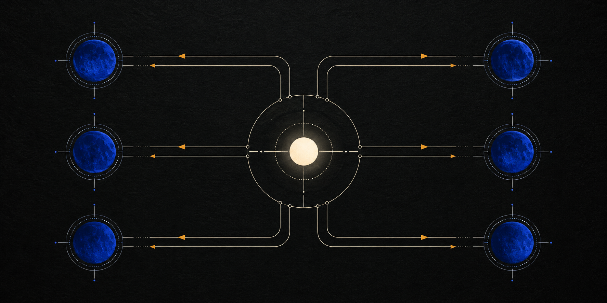

# codex-subculture



I use Codex Subculture as a Sol bridge between me and Luna Max. I stay in a normal Sol thread. When
I activate the protocol, Sol inspects the project, decides the architecture, creates a **new,
first-class Luna Max thread**, and gives it a complete implementation contract. Sol then ends its
turn. Luna signals the Sol thread only when blocked or ready for verification, and Sol returns to
inspect and integrate the result.

This is thread orchestration, not a native subagent loop. The Luna worker has its own `threadId`,
visible history, and separate entry in the Codex task list.

The protocol activates only when the user gives the exact standalone instruction `SUBCULTURE`.
Mentioning, reviewing, or translating the word does not activate it.

## How the bridge works

1. I describe the task in a normal Sol thread and activate `SUBCULTURE`.
2. Sol inspects the project and owns the architecture, plan, and material technical decisions.
3. Sol creates a new user-visible Luna Max thread and sends one self-contained implementation
   contract with locked decisions, scope, acceptance evidence, and the main-thread handoff target.
4. Sol ends its active turn and stays offline. Luna works in its own thread and contacts Sol only
   for a real blocker or a terminal handoff.
5. Sol returns on that signal, independently verifies the implementation, handles bounded
   integration corrections, and accepts the result or requests material rework.

## Why I use it

I prefer Sol for architecture, ambiguous decomposition, integration, and final acceptance. In my
experience, Luna is not reliable enough to own those decisions without strict mediation. I use this
protocol to have Sol inspect the project, lock the plan, write complete worker contracts, resolve
blockers, and verify every terminal handoff. Luna Max receives only bounded implementation work.

The design goal is to approach the implementation quality I expect from Sol without spending Sol
tokens on the entire implementation. Sol spends its budget on architecture, the worker contract,
decisions, and verification; Luna Max spends the larger execution budget. This is a workflow goal,
not a measured quality guarantee.

The intended token shift looks like this:

| Workflow | Illustrative token allocation |
| --- | --- |
| Sol-only baseline | approximately 100 million Sol tokens |
| Subculture target | approximately 50 million Sol tokens and 80+ million Luna tokens |

These figures are a planning scenario, not a measured benchmark, fixed ratio, or guarantee. The
goal is to reduce Sol execution while retaining Sol control over quality-critical decisions.

That control costs time. Complete contracts, separate task handoffs, code inspection, and stricter
verification can make delivery substantially slower than direct single-agent execution.

I also avoid the native Codex subagent lifecycle for this workflow. Subculture requires first-class
Codex tasks with their own `threadId`, visible history, and direct curator handoff. It never
substitutes workers that exist only inside a `Subagents` panel.

## Long-running Sol threads

After a long Luna run, a large Sol thread may resume without a useful warm-cache hit and can be
expensive to reload. When its context window has grown substantially, I may manually compact the
Sol thread before verification. Compaction is optional, and its summary must preserve the locked
architecture, ownership map, worker status, acceptance criteria, and unresolved risks.

## Requirements

- A Codex app environment that exposes app-level task creation through `create_thread`.
- Support for creating tasks in the current saved project with the local environment.
- Sol for the main orchestrator and curator role.
- Luna with Max thinking for the default bounded implementation role.

The protocol does not support CLI-only environments that cannot create user-visible tasks. It
never falls back to internal `spawn_agent`, agent-team, or subagent mechanisms.

## Install from GitHub

The standard Codex skill installer can install this repository directly. It copies only the
`subculture` skill into your normal Codex skills directory.

PowerShell:

```powershell
$codexHome = if ($env:CODEX_HOME) { $env:CODEX_HOME } else { Join-Path $HOME ".codex" }
$installer = Join-Path $codexHome "skills/.system/skill-installer/scripts/install-skill-from-github.py"
python $installer --repo FixAdmin/codex-subculture --path skills/subculture
```

macOS or Linux:

```bash
CODEX_HOME="${CODEX_HOME:-$HOME/.codex}"
python3 "$CODEX_HOME/skills/.system/skill-installer/scripts/install-skill-from-github.py" \
  --repo FixAdmin/codex-subculture \
  --path skills/subculture
```

If a `subculture` directory already exists, the installer will stop instead of overwriting it. Rename or remove the existing installation before reinstalling.

## Install from a local checkout

Copy `skills/subculture` into your Codex skills directory.

PowerShell:

```powershell
Copy-Item -Recurse .\skills\subculture "$HOME\.codex\skills\subculture"
```

macOS or Linux:

```bash
cp -R skills/subculture "${CODEX_HOME:-$HOME/.codex}/skills/subculture"
```

These commands assume that the destination does not already exist. For development, you may link
the destination to this checkout so edits take effect without another copy.

## Repository layout

```text
skills/subculture/
├── SKILL.md
├── agents/
│   └── openai.yaml
└── references/
    └── implementation-brief.md
```

`SKILL.md` contains the orchestration protocol. The bundled reference contains the complete
implementation-contract authoring rules and terminal report format. It is installed and versioned
with this skill, not as a separate skill.

## Validate

```bash
python scripts/validate_skill.py
```

The validator checks the skill metadata, bundled links, mandatory protocol markers, and absence of
the retired standalone brief dependency.

## Compatibility notes

- Worker creation must return a distinct `threadId` and produce a separate task in the Codex task
  list. An entry that appears only under a `Subagents` panel is not compliant.
- Luna Max is the default implementation worker. Terra and other profiles remain optional, but
  architecture and final acceptance stay with Sol.
- The exact activation word is `SUBCULTURE`.

## License

This project is released under the [MIT License](LICENSE). The same license is included in the
installed skill package at `skills/subculture/LICENSE.txt`.

